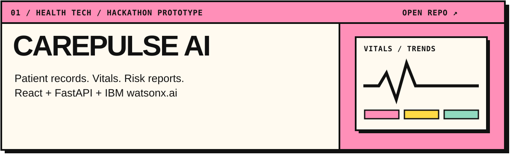
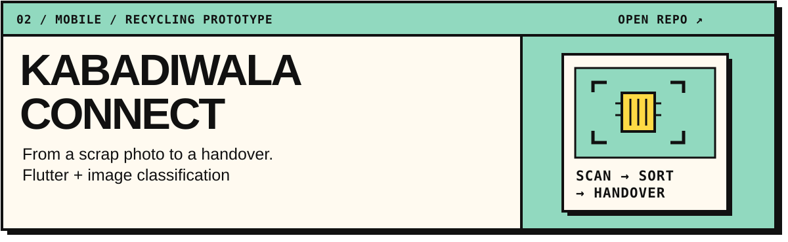
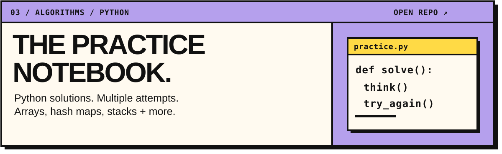
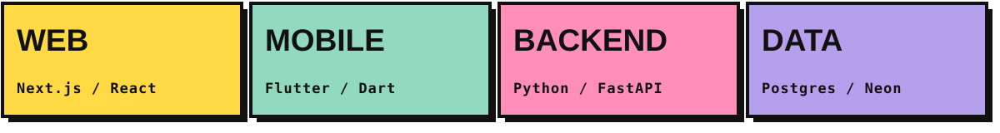

 

I'm Ananya, aka **drunkmonkkk**. My current projects explore chronic disease monitoring and scrap identification. This is where I keep the code, experiments, and problem-solving practice.

**[THE PROJECTS ↓](#the-projects)** &nbsp; / &nbsp; **[THE TOOLBOX ↓](#the-toolbox)** &nbsp; / &nbsp; **[ALL REPOSITORIES ↗](https://github.com/drunkmonkkk?tab=repositories)**

## The projects

**[Explore CarePulse AI ↗](https://github.com/drunkmonkkk/carepulse-AI)** · [Frontend](https://github.com/drunkmonkkk/carepulse-AI/tree/main/Frontend) · [Backend](https://github.com/drunkmonkkk/carepulse-AI/tree/main/backend)

Patient records, vitals trends, alerts, and risk reports in a hackathon prototype. Built for IBM SkillsBuild AICTE 2026.

 

**[Explore the app ↗](https://github.com/drunkmonkkk/kabadiwala_connect)** · [Local inference API](https://github.com/drunkmonkkk/kabadiwala_backend) · [Cloud inference API](https://github.com/drunkmonkkk/kabadiwala_backend_v2)

A scrap collector's workflow: capture an image, identify the material, compare sample recycler listings, and record a handover. Recycler listings and prices are prototype data.

 

**[Browse the notebook ↗](https://github.com/drunkmonkkk/neetcode-submissions)**

Python submissions covering arrays, hash maps, stacks, and two pointers. Multiple attempts stay in the repository.

## The toolbox

Tools used across these projects.

---

**ANANYA SINGH** / [@drunkmonkkk](https://github.com/drunkmonkkk) &nbsp; · &nbsp; Found something interesting? Open an issue in the relevant project.
