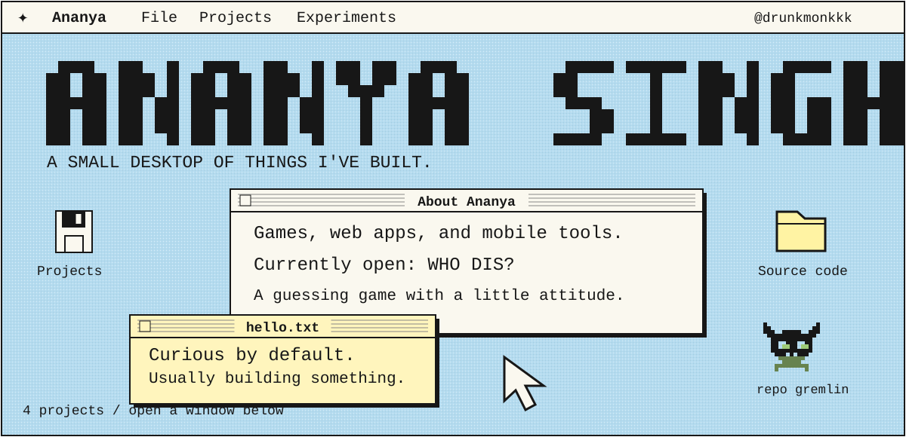
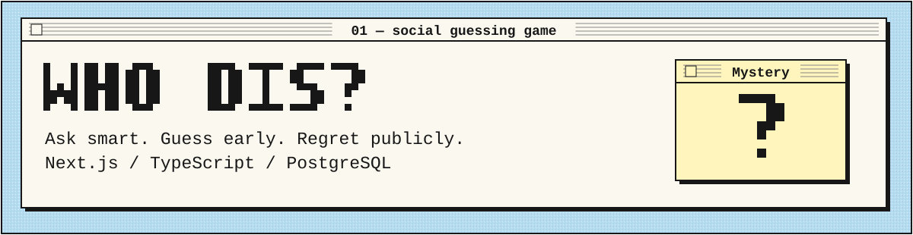
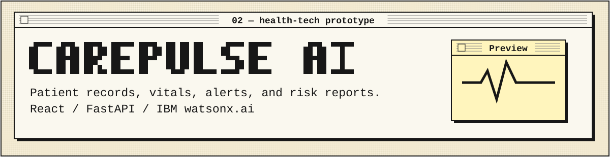
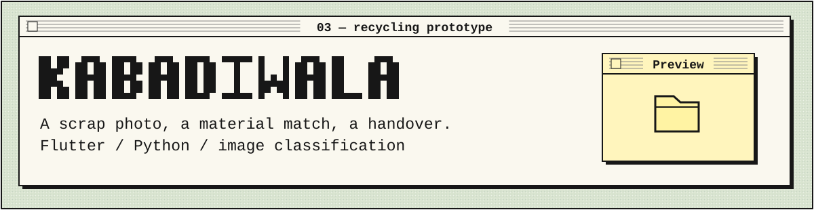
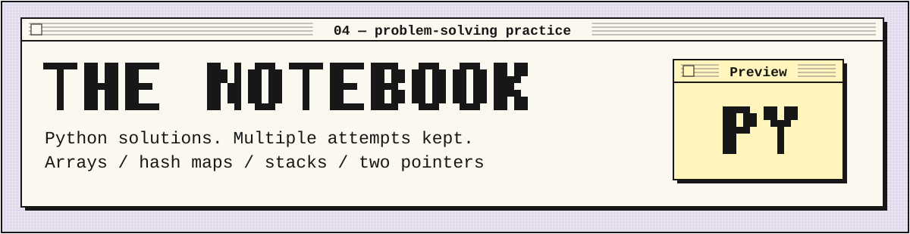
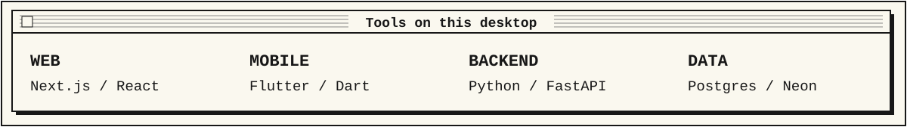

 

I'm **Ananya Singh**, aka **drunkmonkkk**. I build games, web apps, and mobile tools. My work ranges from a social guessing game to health-monitoring and recycling prototypes.

**Latest: [WHO DIS?](https://who-dis-six.vercel.app/)** — ask smart, guess early, regret publicly.

**[OPEN A PROJECT ↓](#open-a-project)** &nbsp; / &nbsp; **[THE TOOLBOX ↓](#on-this-desktop)** &nbsp; / &nbsp; **[ALL REPOSITORIES ↗](https://github.com/drunkmonkkk?tab=repositories)**

## Open a project

**[Play WHO DIS? ↗](https://who-dis-six.vercel.app/)** · [Source code](https://github.com/drunkmonkkk/who-dis) · [Game logic](https://github.com/drunkmonkkk/who-dis/tree/main/lib/game)

One famous person. A few questions. A very confident wrong answer.

A social guessing game with solo play, multiplayer rooms, Hot Seat, daily mysteries, and speed rounds. Built with **Next.js, TypeScript, and Neon PostgreSQL**.

Sourced clues, shared rooms, and server-controlled scoring. Optional AI helps with answer wording; missing evidence stays unknown.

 

**[Explore CarePulse AI ↗](https://github.com/drunkmonkkk/carepulse-AI)** · [Frontend](https://github.com/drunkmonkkk/carepulse-AI/tree/main/Frontend) · [Backend](https://github.com/drunkmonkkk/carepulse-AI/tree/main/backend)

Patient records, vitals trends, alerts, and risk reports in a hackathon prototype. Built for IBM SkillsBuild AICTE 2026.

 

**[Explore the app ↗](https://github.com/drunkmonkkk/kabadiwala_connect)** · [Local inference API](https://github.com/drunkmonkkk/kabadiwala_backend) · [Cloud inference API](https://github.com/drunkmonkkk/kabadiwala_backend_v2)

A scrap collector's workflow: capture an image, identify the material, compare sample recycler listings, and record a handover. Recycler listings and prices are prototype data.

 

**[Browse the notebook ↗](https://github.com/drunkmonkkk/neetcode-submissions)**

Python submissions covering arrays, hash maps, stacks, and two pointers. Multiple attempts stay in the repository.

## On this desktop

**TypeScript** across my web projects · **PostgreSQL / Neon** for WHO DIS? rooms · **IBM watsonx.ai** in my AI prototypes.

[LinkedIn ↗](https://www.linkedin.com/in/ananya-singh158/) · [Browse all repositories ↗](https://github.com/drunkmonkkk?tab=repositories)

---

**ANANYA SINGH** / [@drunkmonkkk](https://github.com/drunkmonkkk) &nbsp; · &nbsp; Found something interesting? Open an issue in the relevant project.
