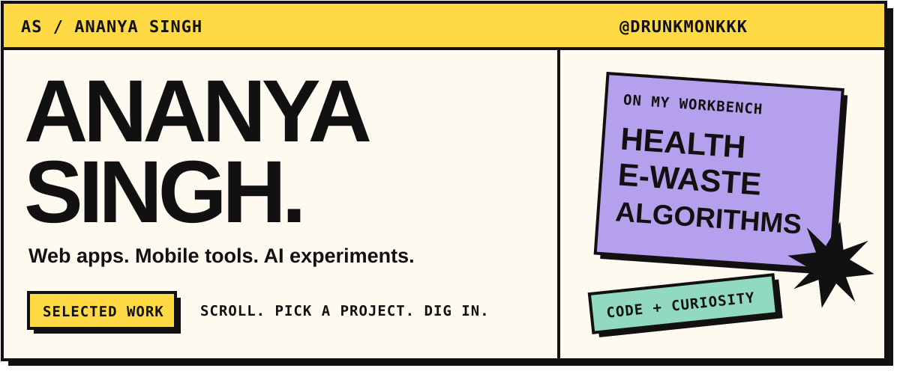

I build across web, mobile, and applied AI. My projects include a chronic disease monitoring prototype and a Flutter application with companion backend repositories.

[Explore my repositories](https://github.com/drunkmonkkk?tab=repositories)

### Selected work

| Project | What you'll find |
| :--- | :--- |
| [**CarePulse AI ↗**](https://github.com/drunkmonkkk/carepulse-AI) | A chronic disease monitoring prototype for the IBM SkillsBuild AICTE 2026 Hackathon. React, TypeScript, FastAPI, and IBM watsonx.ai. |
| [**Kabadiwala Connect ↗**](https://github.com/drunkmonkkk/kabadiwala_connect) | A Flutter application, with its companion [backend repository](https://github.com/drunkmonkkk/kabadiwala_backend_v2). |
| [**Problem-solving practice ↗**](https://github.com/drunkmonkkk/neetcode-submissions) | My NeetCode submission repository. |

### Technologies in my projects

React · TypeScript · Python · FastAPI · Flutter · IBM watsonx.ai

---

*Explore a project, read the code, or open an issue to start a conversation.*
